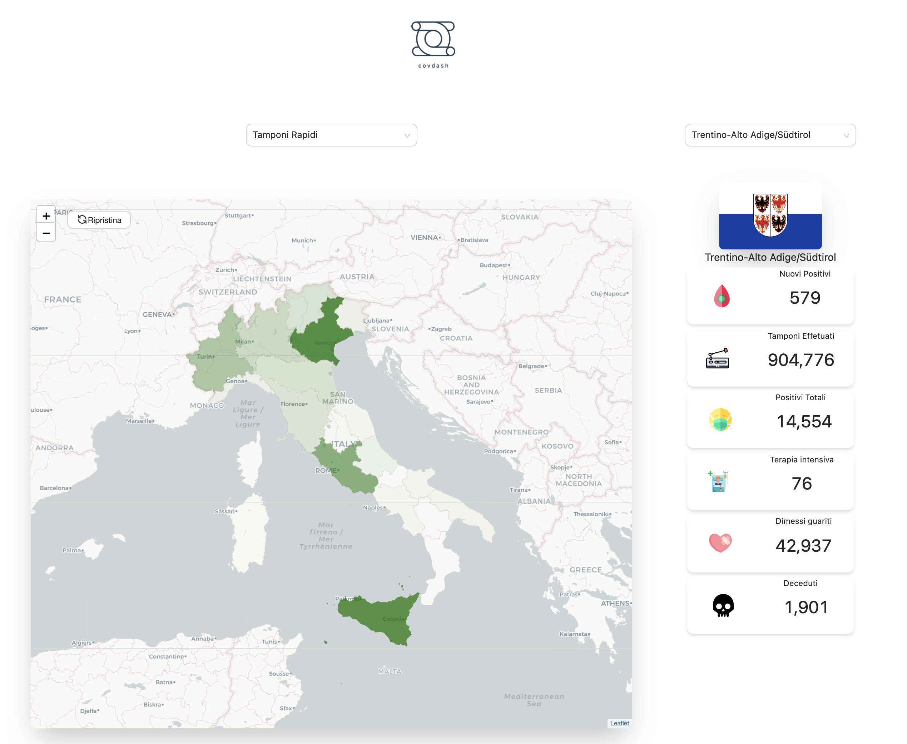

# Covdash 

## Project Description

<p align="center">
  
</p>

The intent of the project is to have a dashboard that would show a map of Italy as well as other data regarding the covid pandemic.


## Current state of the project


<p align="center">
  
</p>


## DevOps

github repo -> azure static website is deployed through github actions

[deploying python flask app to azure](https://blog.siliconvalve.com/2019/03/22/use-github-actions-to-deploy-a-python-flask-web-app-to-azure-app-service-on-linux/)


## Architecture 

<p align="center">
  
</p>


### Frontend part:

### Libraries used :
  - tailwind css
  - antd
  - react-leaflet for map

### Features :
- showing a map of italy, with each regions and the stats (using leaflet with mapbox for colors)
- charts about the data using (using nivo rocks or something similar)
- dark theme react using react context api
- add the instructions for each region and zone color in own custom part
- maybe if we have enough time add google analytics to the project


### Components breakdown

for now this is what we want to have
1 class component the rest is stateless
<App /> is at the highest level

<Dashboard /> stateful, selectedProperty (filter: deceduti, morti, ...) selectedRegion (Lazio, Piemonte ...) and fetchs the region data when it mounts (class component)
    - <PropertyChooser /> stateless, sets a state of the selectedProperty. (functional component)
    - <Italy /> stateless, contains a map of italy. (must use hooks, because of the library)
    - <PropertyList /> stateless, shows the properties
        - <Property /> stateless
    - <Graph /> stateless shows the graph, is not affected by selectedRegion, only by selectedProperty
    - <DarkModeToggler /> toggles between dark mode


### Backend part (mostly scraping):


In order to start the scraping

```
# run tests
pytest -s

# running the program
python3 -m crawling.crawling_script

```


this will create a new folder called `data` with the `csv` and `geojson` subfolders inside of it


```

. /venv/bin/activate

flask run

```


run tests from backend folder

```
pytest

```


## enable hot reload on flask

```
FLASK_APP=app.py FLASK_ENV=development flask run
```

- depending on the scraper, see if it's easier in python

- scrape the stats from the covid repo data  
- once it is scraped, save to our elasticsearch node that goes through a server written in dotnet core
- convert csv files into geojson files. 
- write some testing before hand, try to give it bad csv files, if it goes wrong, email the dev or alert him somehow (this is a critical feature, erros in this will damage data integrity across the systems) !


- maybe scrape some other data from other sources if we have enough time
- add APM to elasticsearch to catch exceptions

### Dbs :
- elasticsearch for the data we crawled

### Ops (sysadmin) part:

- hosting the website on a real production website hosted on aruba cloud
- nginx proper configuration
- ssl properly configured with LetsEncrypt certificates
- use local version of kibana to check out and play with the data.


## Steps and comments on the tech stack 
- do backend first, then frontend, and finally deploy on cloud  
- there is no authentication, since we are designing something that should in theory be accessible to the public. It wouldn't make sense to have an auth gateway except for analytics.
- We could use mongo as a db, but we wouldn't be able to include kibana's visualizations easy (we would need to do something like .net => mongodb => elasticsearch).
- .Net Core was chosen because of familiarity and it is considered a relatively fast and reliable backend server technology.
- React was chosen because of familiarity and it seemed suitable for the task. 


### helpful links 
- [geojson format](https://geojson.io/#map=6/42.057/9.613)
- [covid data for each region](https://github.com/pcm-dpc/COVID-19/tree/master/dati-regioni)
- [governo italiano](http://www.governo.it/it/articolo/domande-frequenti-sulle-misure-adottate-dal-governo/15638?gclid=CjwKCAiAwrf-BRA9EiwAUWwKXicC1bzopYynHP9pvRxHUza7Ar4dte9hWHi55Uj4xfuAHanOCf7a1BoCTggQAvD_BwE#zone)
- [leaflet tutorial for maps](https://leafletjs.com/examples/choropleth/)
- [top chart libraries for react](https://www.overloop.io/blog/top-5-react-chart-libraries)


## Contribution

Feel free to contribute and submit pull requests, and propose any suggestions regarding anything about the project.


