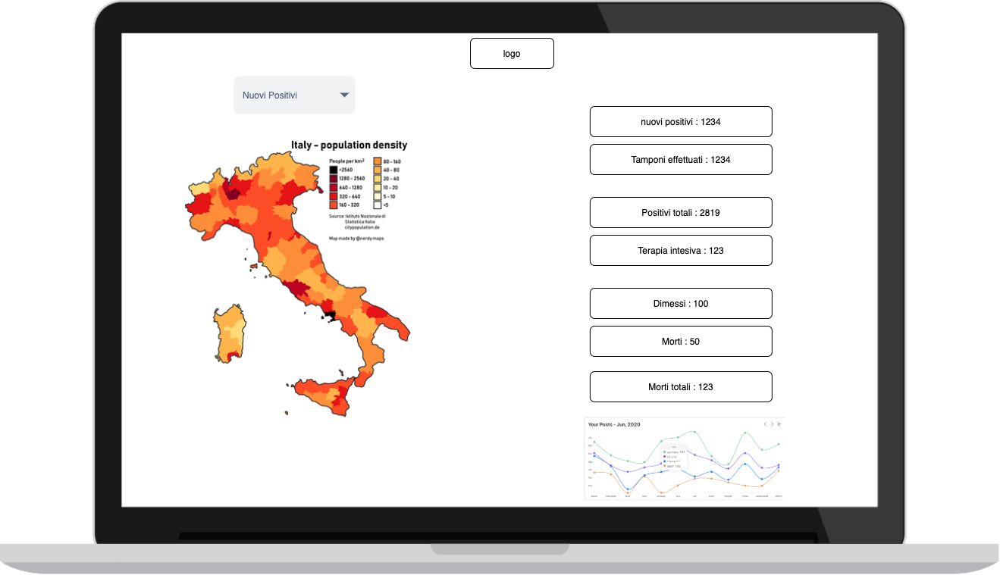
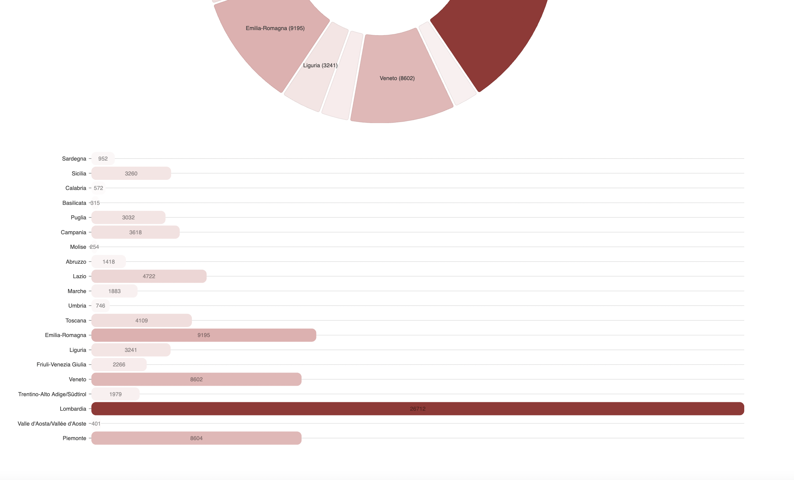

---


```
backend: csv -> geojson
frontend: showing the data
devops: automate the dev cycle
```

Key items:
 - Map visualization 
 - flask backend
 - azure cloud 
 - github actions

initial time was planned to be 16hrs but I extended it to 25 hours (because of the challenges)

---

# The prototype

---


---




---


---


---


---


---


---


---



---


---


---

# Potential improvements
- aggiungere le zone (gialla, arancione, rossa)
- aggiungere i dati sulle vaccinazioni


---

# https://nizapizza.com